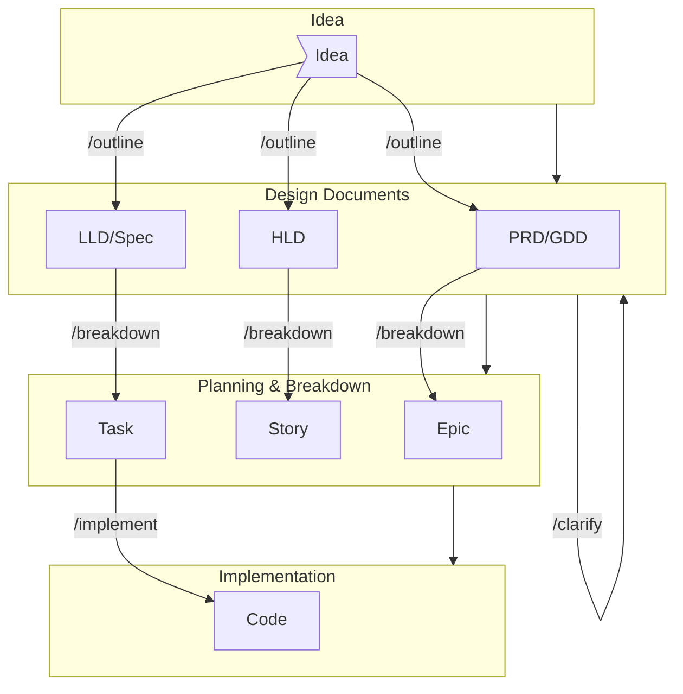

# Code with AI (CwAI)

```text
   _____                _____
  / ____|           _  |_   _|
 | |     __      _ / \   | |
 | |     \ \ /\ / / / \  | |
 | |____  \ V  V / ____\_| |_
  \_____|  \_/\_/_/    \_____/

            C w A I
          Code with AI
```

> [!WARNING]
>
> This project is intentionally a work-in-progress. We're designing the framework **_while_** using it, and keeping the rough edges visible instead of hiding them.
>
> **AI Behavior Variability:** We make no guarantees that these prompts will behave with 100% accuracy or consistency. AI models are inherently non-deterministic and unpredictable. The same prompt executed twice may produce different results, vary between AI providers (Copilot, Claude, Gemini), or change behavior across model versions. This variability is a fundamental characteristic of large language models, not a flaw in the prompts themselves.
>
> Use the following prompts as **guidance and scaffolding**, not as deterministic tools. Always review, validate, and adjust AI output to fit your specific context and requirements.

---

## Why This Exists

Most "AI assisted dev" flows jump straight from a fuzzy sentence to code. That feels fast—until the third rework sprint. CwAI tries to slow you **just enough** to:

1. Write down intent before syntax
2. Expose ambiguity early (on purpose, with `[NEEDS CLARIFICATION: …]`)
3. Plan thin vertical slices you can actually deliver
4. Let implementation prompts lean on real artifacts instead of vapor

The goal is not bureaucracy. It’s: reduce cognitive load, increase shared context, and make large changes feel safe.

### What This Is (and Isn’t)

| Is                            | Isn’t                                    |
| ----------------------------- | ---------------------------------------- |
| Opinionated workflow skeleton | A locked-down framework                  |
| Design + planning scaffolding | A replacement for architectural judgment |
| Prompts you can fork & remix  | Magic "build my SaaS" button             |
| Learning-in-public experiment | Guaranteed best practice                 |

### Current Status

Alpha. Expect:

- Gaps (e.g. `/implement` prompt still intentionally blank)
- Occasional naming shifts
- Evolving templates (PRD/HLD/LLD/GDD/Spec may tighten)
- Missing automation (diagram helpers, test harness generation, etc.)

### Important Disclaimer

> [!WARNING]
> **AI Behavior Variability:** We make no guarantees that these prompts will behave with 100% accuracy or consistency. AI models are inherently non-deterministic and unpredictable. The same prompt executed twice may produce different results, vary between AI providers (Copilot, Claude, Gemini), or change behavior across model versions. This variability is a fundamental characteristic of large language models, not a flaw in the prompts themselves.
>
> Use these prompts as **guidance and scaffolding**, not as deterministic tools. Always review, validate, and adjust AI output to fit your specific context and requirements.

### Table of Contents (because this grew fast)

- [Code with AI (CwAI)](#code-with-ai-cwai)
  - [Why This Exists](#why-this-exists)
    - [What This Is (and Isn’t)](#what-this-is-and-isnt)
    - [Current Status](#current-status)
    - [Important Disclaimer](#important-disclaimer)
    - [Table of Contents (because this grew fast)](#table-of-contents-because-this-grew-fast)
  - [Quick Start](#quick-start)
    - [macOS/Linux/WSL (Bash) Installation](#macoslinuxwsl-bash-installation)
    - [Windows (PowerShell) Installation](#windows-powershell-installation)
    - [Usage](#usage)
      - [Installation](#installation)
    - [Requirements](#requirements)
      - [For Bash (macOS/Linux)](#for-bash-macoslinux)
      - [For PowerShell (Windows/Cross-platform)](#for-powershell-windowscross-platform)
  - [Configuration](#configuration)
  - [Core Workflow Overview](#core-workflow-overview)
    - [`/outline` – From Requirement Sentence to Structured Specs](#outline--from-requirement-sentence-to-structured-specs)
    - [`/clarify` – Eliminate Ambiguity](#clarify--eliminate-ambiguity)
    - [`/breakdown` – Convert Design to Delivery Plan](#breakdown--convert-design-to-delivery-plan)
    - [`/implement` – Guided Coding](#implement--guided-coding)
    - [Typical End-to-End Session](#typical-end-to-end-session)
    - [Feature Folder Anatomy](#feature-folder-anatomy)
  - [Feature/Task Management](#featuretask-management)
    - [Local vs GitHub Issue Manager](#local-vs-github-issue-manager)
  - [Conventions \& Guardrails](#conventions--guardrails)
  - [Philosophy in Practice](#philosophy-in-practice)
    - [Influences \& Acknowledgements](#influences--acknowledgements)

---

An opinionated, prompt‑driven workflow to move a feature or product idea from a raw sentence to something you can actually ship—without pretending ambiguity doesn’t exist.

1. Structured design documents (PRD / HLD / LLD / GDD)
2. Clarified, ambiguity‑reduced specs
3. Executable delivery plan (Epics → Stories → Tasks)
4. Guided implementation phase

All via four tiny "verbs" you teach your AI assistant: `/outline`, `/clarify`, `/breakdown`, `/implement`.

The project ships:

- Reusable prompt definitions in `.cwai/prompts/`
- Authoritative document templates in `.cwai/templates/outline/` and planning template `plan.md`
- Feature scaffolding scripts:
  - **Bash**: `.cwai/scripts/create-feature.sh` with utilities in `common.sh`
  - **PowerShell**: `.cwai/scripts/create-feature.ps1` with utilities in `common.ps1`
  - **Documentation**: Plain English guides in `common.md` and `create-feature.md`
- Local issue/spec storage (filesystem) with optional GitHub syncing

---

## Quick Start

### macOS/Linux/WSL (Bash) Installation

```bash
bash <(curl -sSL https://raw.githubusercontent.com/templ-project/code-with-ai/refs/heads/main/install.sh)
```

### Windows (PowerShell) Installation

```powershell
powershell -NoProfile -ExecutionPolicy Bypass -Command "iwr -UseBasicParsing https://raw.githubusercontent.com/templ-project/code-with-ai/refs/heads/main/install.ps1 | iex"
```

### Usage

After install, your chosen AI tool (Copilot / Claude / Gemini) will have access to the prompts (`/outline`, `/clarify`, `/breakdown`, `/implement`).

#### Installation

```bash
# Using npm
npm install templ-project/code-with-ai && cwai-install

# Using npx (recommended - installs package then runs command)
npx --yes --package=github:templ-project/code-with-ai cwai-install

# Using uv
uv tool install git+https://github.com/templ-project/code-with-ai.git && cwai-install

# Using uvx (recommended)
uvx --from git+https://github.com/templ-project/code-with-ai.git cwai-install
```

### Requirements

- Optional (GitHub integration): `gh` CLI authenticated

#### For Bash (macOS/Linux)

- Bash 4+
- `git`, `jq`, `find`, `cp`, `mkdir`, `rm`

#### For PowerShell (Windows/Cross-platform)

- PowerShell 5.1+ (Windows) or PowerShell Core 6+ (cross-platform)
- Git

---

## Configuration

Environment variables (can be placed in `.env` or `.env.local` in repo root):

| Variable             | Default   | Purpose                                             |
| -------------------- | --------- | --------------------------------------------------- |
| `CWAI_SPECS_FOLDER`  | `specs`   | Root folder where feature spec folders are created  |
| `CWAI_ISSUE_MANAGER` | `localfs` | `localfs` (filesystem only) or `github` (uses `gh`) |

When using `github` issue manager the script mirrors issues locally under the specs folder (creates `issue.json`).

---

## Core Workflow Overview



In short: Idea → Design (/outline) → Clarify loop (/clarify) → Planning (/breakdown) → Implementation (/implement).

| Phase                  | Command      | Output Artifacts                                                                      | Objective                                                   |
| ---------------------- | ------------ | ------------------------------------------------------------------------------------- | ----------------------------------------------------------- |
| Ideation / Scaffolding | `/outline`   | `specs/<id>-<slug>/high-level-design.md` (or other selected templates) + `issue.json` | Create initial structured design docs & branch              |
| Clarification          | `/clarify`   | Updated in‑place doc (version bumped)                                                 | Remove ambiguity; add precise questions & integrate answers |
| Planning               | `/breakdown` | `<document>.plan.md` (or `.plan.json`)                                                | Delivery plan with Epics → Stories → Tasks                  |
| Implementation         | `/implement` | Code, updates, follow‑up tasks                                                        | Guided development aligned with plan                        |

> Each stage depends on the previous one being "clean" (no unresolved `[NEEDS CLARIFICATION]` tags where mandatory).

---

### `/outline` – From Requirement Sentence to Structured Specs

Use when: You have an unstructured feature thought ("Add MFA to login") and want a shaped, inspectable starting spec _before_ you start breaking things.

Runs `.cwai/scripts/create-feature.{sh,ps1}` script to scaffold a feature: branch, `specs/<id>-<slug>/`, `issue.json`, copied templates and drafts a design document based on the templates from `.cwai/templates/outline` and your input -- keeps `[NEEDS CLARIFICATION]` markers instead of guessing.

```text
/outline Add multi-factor authentication to user login --type high-level-design

/outline Implement configuration service to centralize feature flags --type high-level-design --json

/outline Design an EventManager --type low-level-design --json --stack typescript,node,deno
```

**Arguments**:

- `--type` (optional) `product-requirement`, `game-design` `high-level-design`, `low-level-design`, `spec-document` If not mentioned, will try to detect it based on key words
- `--stack` (optional) Mention only for LLDs, specify language stack (multiple words joined by comma)
- `--json` (optional) If not mentioned, will print final output as Markdown and not JSON

Outputs a short summary: `BRANCH_NAME`, `FEATURE_FOLDER`, `COPIED_TEMPLATES`. Skim the doc and keep genuine `[NEEDS CLARIFICATION]` until you know the answers.

---

### `/clarify` – Eliminate Ambiguity

Use when: A design doc _exists_ but you feel that uneasy "We’re still guessing in three places" sensation.

Arguments (free text after the command):

- `--type <prd|hld|lld|gdd>` (optional)
- `--focus security,performance` (optional)
- `--max-items 8` (optional, default 5)
- Path to doc (required): `specs/<id>-<slug>/<doc>.md`

What happens:

- Loads the doc + `issue.json`, infers type if needed, compares with the template.
- Produces structured questions (ID, Domain, Severity, Context, Question, Required Data Form).
- You answer; it integrates answers, removes resolved `[NEEDS CLARIFICATION]`, bumps version.

Example:

```text
/clarify --type hld --focus security,performance --max-items 6 specs/00001-config-service/high-level-design.md
```

You reply with answers (one pass or iterative). The assistant patches the doc, bumps version, and removes only what’s truly resolved.

Exit notes: If the document is missing you’ll get an error; if critical blockers remain, run `/clarify` again until clean.

---

### `/breakdown` – Convert Design to Delivery Plan

Use when: The design feels _boringly unambiguous_ and you’re itching to build.

Key flags: `--type hld` (optional), `--format markdown|json` (default markdown), `--max-items 10` (default 6).

Output: Places `high-level-design.plan.md` (or `.json`) next to the source. Includes Epics/Stories/Tasks with Value, Effort, Risk, Priority, Release, Dependencies, Acceptance Criteria, and traceability to source sections.

Example:

```text
/breakdown specs/00001-config-service/high-level-design.md --type hld --max-items 8 --format markdown
```

Errors (explicit by design): too little signal (<2 capabilities) → `ERROR: insufficient_signal`; missing path → `ERROR: invalid_document`.

---

### `/implement` – Guided Coding

Use when: You’ve picked the next slice and want the AI to act like a careful pair, not a code firehose.

Defined in `.cwai/prompts/implement.md`. Scope:

- Accept one or more item IDs, pull acceptance criteria and context.
- Propose minimal, grouped commits; confirm before destructive edits.
- Generate/update tests and validate against acceptance criteria.
- Track follow-ups or new clarifications when unknowns emerge.

Suggested invocation:

```text
/implement Implement Story S-001-01 from specs/00001-config-service/high-level-design.plan.md focusing on API layer first
```

### Typical End-to-End Session

```text
/outline Add config service for feature flag management --template high-level-design --labels platform,infra
→ Review generated high-level-design.md (leave genuine uncertainties)

/clarify specs/00001-config-service/high-level-design.md --focus security,performance
→ Provide answers, receive updated doc without unresolved blockers

/breakdown specs/00001-config-service/high-level-design.md --max-items 8
→ Get high-level-design.plan.md with Epics/Stories/Tasks

/implement Implement Story S-001-01 (Fetch config by key) using FastAPI; propose file structure first
→ Iterate until tests & acceptance criteria satisfied
```

### Feature Folder Anatomy

After `/outline` (and sometimes a follow-up `/clarify`) you will typically see:

```text
specs/
    00001-config-service/
        issue.json                  # Local issue metadata & history
        high-level-design.md        # Or chosen templates
        product-requirement-document.md
        low-level-design.md         # (If selected)
        game-design.md              # (If selected for game features)
        high-level-design.plan.md   # After /breakdown
```

`issue.json` tracks: id, title, description, labels, comments, timestamps.

---

## Feature/Task Management

### Local vs GitHub Issue Manager

Set `CWAI_ISSUE_MANAGER=github` to also create a real GitHub issue (mirrored locally). Great for bringing non‑AI teammates along.

Label semantics (you can extend): `task`, `auto-generated`, plus any you pass via `--labels`.

Removing labels: prefix with `-` (e.g., `--labels -development`).

---

## Conventions & Guardrails

Core promises to yourself:

- Don’t invent—write the uncertainty _down_.
- HLD = architectural intent & justification. No vendor SKU shopping.
- LLD = internal structure & contracts. Still not code dumps.
- Planning IDs are sticky; avoid renumber churn (it kills traceability).
- Acceptance criteria are user/system observable. Not "refactor X util".
- Diagrams help offload working memory. Use Mermaid when possible.

---

Feel free to adapt the templates or extend prompts for your domain (data engineering, ML, platform infra, gameplay, etc.).

---

## Philosophy in Practice

The loop intentionally enforces _progressive elaboration_:

Idea → (outline) → (clarify) → (plan) → (implement) → (discover) → (clarify again) …

It’s fine—even healthy—to re-enter `/clarify` mid‑implementation when reality bites. The guardrails exist to make that a _cheap_ move instead of a political one.

### Influences & Acknowledgements

Big inspiration came from people exploring "spec first" + "Markdown as a programming language" ideas:

- GitHub Spec Kit: <https://github.com/github/spec-kit>
- CaptainCrouton89's Claude prompt repo: <https://github.com/CaptainCrouton89/.claude>
- Spec‑driven development blog (GitHub): <https://github.blog/ai-and-ml/generative-ai/spec-driven-development-using-markdown-as-a-programming-language-when-building-with-ai/>
- Broader thinking around structured prompting & iterative refinement (various articles—some behind consent walls)

If you maintain one of those projects and want clearer attribution, reach out or open an issue.

---

If any of this resonates—or annoys you productively—open an issue with a concrete example. That feedback loop is the whole point.

Happy prompt‑driven building! 🚀
