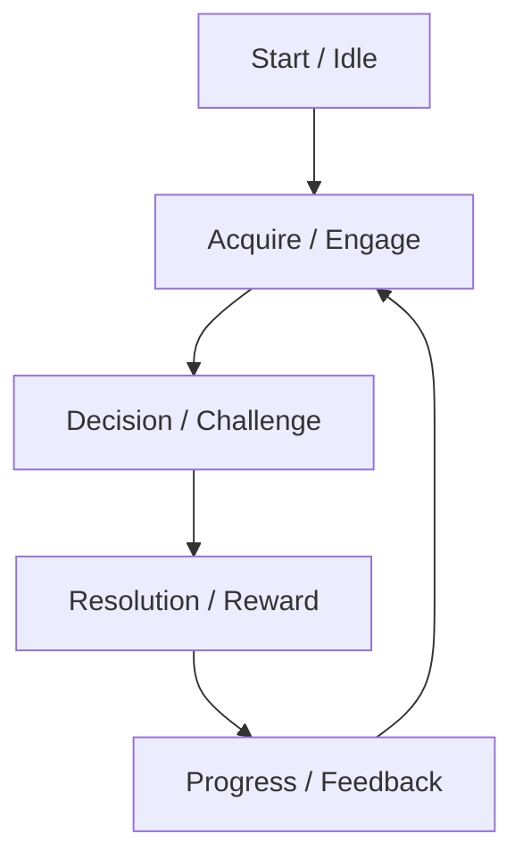

# Game Design: <Title>

## 1. High Concept

<!-- One or two sentences capturing the core identity / elevator pitch. -->

## 2. Purpose & Target Audience

- Primary audience
- Player motivation (what emotional loop?)
- Session length (qualitative, e.g., "short bursts", "extended strategic")

## 3. Player Fantasy & Pillars

- Pillar 1: <short phrase + one sentence>
- Pillar 2: ...
- Pillar 3: ... (3–5 total)

## 4. Core Loop

<!-- Describe the repeating cycle in 3–6 steps. -->

## 5. Session Flow

Short textual walkthrough from launch → first decision → escalation → closure.

## 6. Rules

### 6.1 Setup

### 6.2 Turn / Phase Structure (if applicable)

### 6.3 Player Actions

- Action Name: Preconditions → Outcome → Risk/Reward

### 6.4 Constraints & Limits

## 7. Mechanics

List each core mechanic:

- **Name** – Description; Purpose; Player Impact; Failure / Edge considerations

## 8. Entities & Attributes

| Entity | Purpose | Key Attributes | Interactions |
| ------ | ------- | -------------- | ------------ |
|        |         |                |              |

## 9. Progression & Difficulty

- Unlock model / gating (qualitative)
- Difficulty ramp principles
- Adaptive elements (if any)

## 10. Win / Loss / Failure Conditions

- Win: ...
- Loss: ...
- Soft fail / recovery: ...

## 11. Reward Systems (If Present)

- Type → Player Value → Frequency → Anti-grind safeguards

## 12. Feedback & Juiciness (Non-technical)

How the game communicates success/failure state (verbs only; no implementation tech).

## 13. Accessibility & Fairness

- Cognitive load mitigation
- Fairness principles
- Avoided negative patterns

## 14. Edge Cases & Exploits

List potential abuses & mitigation principles.

## 15. Content Scope (Initial Slice)

What is included in the first playable vertical slice (narrow, representative, minimal).

## 16. Open Questions

? Unresolved assumption...
? Ambiguous rule...

## 17. Out of Scope (Explicit Exclusions)

- Not including multiplayer
- No economy balancing pass
